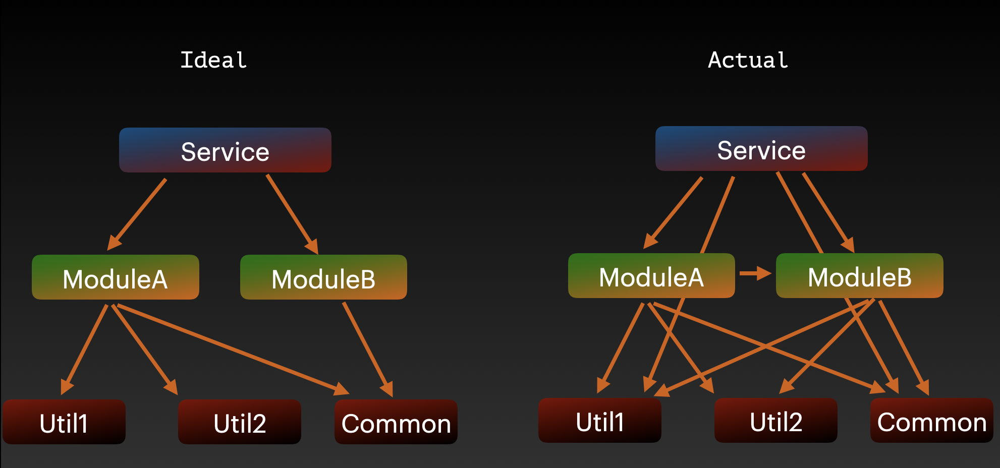
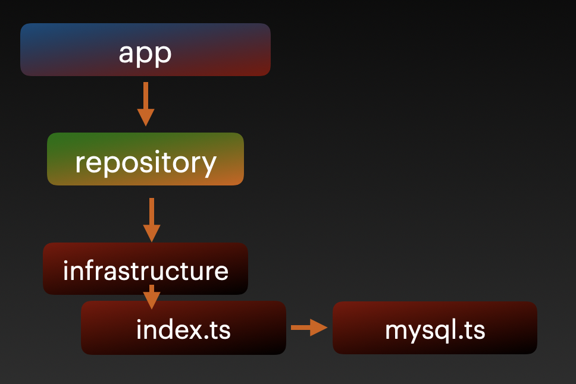

# eslint-plugin-dependency-relation
Import relation linting rule for ESLint.  
beta-version, testing now.

Can use this in.

- JavaScript Project
- TypeScript Project
- React Project
- Vue Project

## Motivation
The import relation is difficult to have being clean, because many developers join in development and every member don't necessarily know a lot about implicit import relation rules.
Hence, even if you DID think of what is the best architect at beginning, someone will break the great rules one day, then someone who see it will also break rule, then someone..... ultimately import relation will become very complex like below.



Since we're human, we have no choice.
Instead, lets' use this eslint-plugin😀.

This plugin protects the great rule you thought of, like below.

```javascript
// @dependency-relation: allow: ../app.js
export function moduleA() {
  
}
```

This comment means this module is able to be imported just only from `../app.js` file, so if you try to import moduleA from any place besides the file(`../app.js`), this plugin will get mad at you and inform broken the great rule.

```
import path ../../moduleA is not allowed from this file  dependency-relation/import
```

## Installation
Install [ESLint](https://github.com/eslint/eslint) before using this plugin, please.
To make sure how to install eslint, please visit [eslint page](https://github.com/eslint/eslint)

```
yarn add eslint-plugin-dependency-relation -D
```

or

```
npm install eslint-plugin-dependency-relation -D
```

## Configuration
- for js Project
- for ts Project(including React Project)
- for vue project

### for js project
You can use this plugin by adding below info to `.eslintrc`.

```json
{
  "plugins": ["dependency-relation"],
  "extends": ["plugin:dependency-relation/presetJs"]
}
```

### for ts project
If you'd like this plugin in ts project, need to install [@typescript-eslint/parser](https://github.com/typescript-eslint/typescript-eslint/tree/master/packages/parser).

```
yarn add -D typescript @typescript-eslint/parser
```
or
```
npm i --save-dev typescript @typescript-eslint/parser
```

You can use this plugin by adding below properties to `.eslintrc`.

```json
{
  "plugins": ["dependency-relation"],
  "extends": ["plugin:dependency-relation/preset"]
}
```

If you'd like to do manual configuration, please see Manual Configuration(ts) section.

### for vue project
If you'd like this plugin in your vue project.
You need to add some properties to `.eslintrc` like this.

```json
{
  "plugins": ["dependency-relation"],
  "extends": [
    "@vue/typescript/recommended",
    "plugin:dependency-relation/presetVue"
  ]
}
```


## Rules
### import
To make sure details, please see [this doc](https://github.com/YutamaKotaro/eslint-plugin-dependencies-relation/blob/main/docs/rules/import.md).
`import` is the rule to limit importing file from a lot of location.

Let's say there are two directories and three files.

```json
┝ app.ts
┝ repository
│　　└ index.ts
└ infrastracture
    ┝ index.ts
    └ mysql.ts
```

In addition, let's say there are other rules you want to limit.



1. don't allow accessing `infrastracture directory` besides `repository directory`
2. don't allow direct accessing `mysql.ts`. (e.g import {save} from './infrastracture/mysql'). Instead, allow accessing `mysql` module via `index.ts`

#### write rule
At first let's write rule, but all thing I'll introduce you are just only basic rule.

To achieve rule 1 and rule2, we need to write comment in `infrastructure/index.ts`.

```javascript
// @dependency-relation: allowOnly@root: ../repository
```

We're using `allonOnly@root` options in this example.
This rule means
- This directory's files arn't able to be imported except index file(`index.ts`)
- This directory's files arn't able to be imported except `../repository` dir.

Hence, it's oke to just only write this comment (it may be better to write comment in repository).

I have a few useful option which has a lot of behaviors, please see details [details](https://github.com/YutamaKotaro/eslint-plugin-dependencies-relation/blob/main/docs/rules/import.md)


### require
This rule is as same as import, but this rule expect requireSyntax instead of import.

## Manual Configuration(ts)
In order to set up manually, it's better to write it in your `.eslintrc`.
Note: If you use preset, don't need this section.

```json
{
    "settings": {
        "import/resolver": {
          "node": {
            "extensions": [".ts", ".tsx", ".js", ".jsx"]
          }
        },
      "rules": {
        "dependency-relation/import": 2,
        "dependency-relation/require": 2
      }
    } 
}
```

In addition, if you'd like to ignore test directories from this plugin.
It's better to use [ignorePatterns](https://eslint.org/docs/user-guide/configuring/ignoring-code#ignorepatterns-in-config-files) like below.

Note: At default, `*.spec.*` or `*.test.*` file will be ignored by this plugin. 

```json
{
  "ignorePatterns": ["tests/*spec.js"],
  "rules": {
    "dependency-relation/import": 0,
    "dependency-relation/require": 0
  }
}
```


